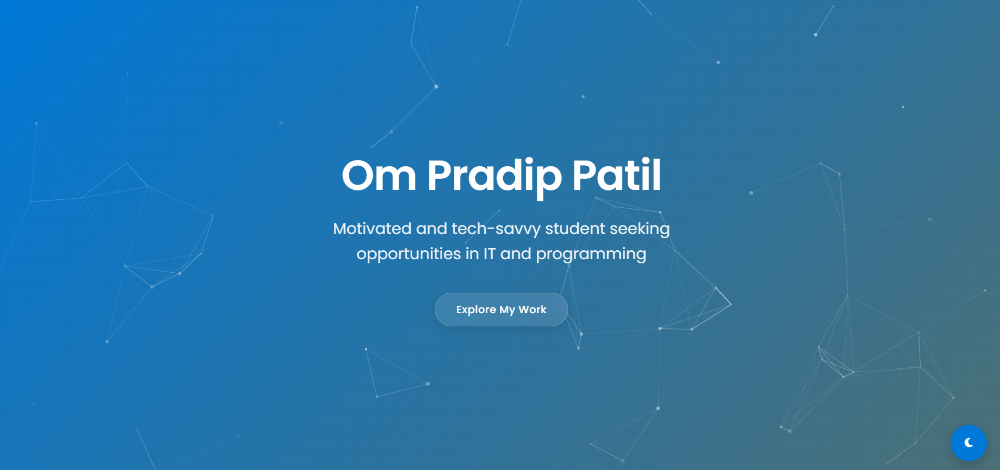
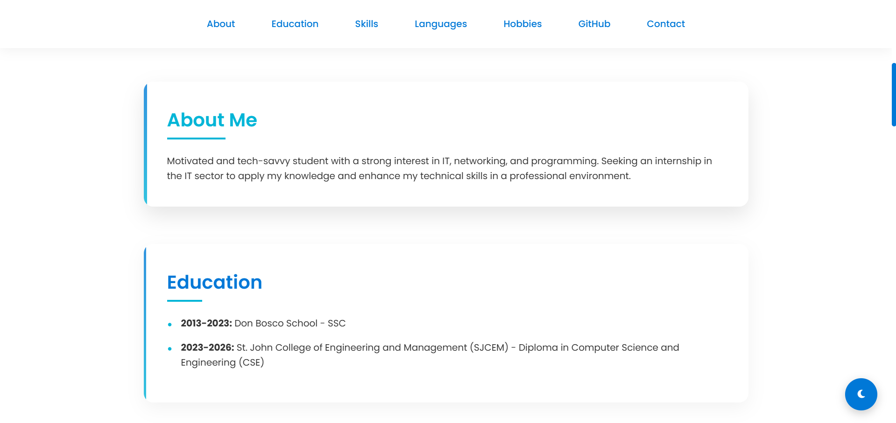

# Om Pradip Patil - Portfolio Website



## 🚀 [Live Demo](https://ompradippatil.netlify.app/)

A modern, responsive personal portfolio website showcasing my skills, education, and projects as a Computer Science Engineering student.

## 📋 Features

- **Responsive Design**: Optimized for all devices (desktop, tablet, mobile)
- **Interactive UI**: Animated sections with GSAP and Particles.js
- **Dark/Light Mode**: Toggle between color schemes
- **Modern UI Elements**: Clean cards, smooth animations, and intuitive navigation
- **Performance Optimized**: Fast loading and smooth scrolling experience

## 🛠️ Built With

- HTML5
- CSS3 (with custom properties)
- JavaScript (Vanilla)
- GSAP Animation Library
- Particles.js
- FontAwesome Icons

## 🖥️ Local Development

To run this project locally:

1. Clone this repository
   ```bash
   git clone https://github.com/omspradippatil/My-Website.git
   ```

2. Navigate to the project folder
   ```bash
   cd My-Website
   ```

3. Open `index.html` in your browser or use a local server
   ```bash
   # If you have Python installed
   python -m http.server
   ```

## 📸 Screenshots

<details>
  <summary>View screenshots</summary>
  
  ### Home Section
  
  
  ### About Section
  
</details>

## 🔄 Updates & Roadmap

- [x] Initial release
- [x] Added GitHub section
- [ ] Add project portfolio section
- [ ] Implement content management system
- [ ] Add blog section

## 📄 License

This project is open source and available under the [MIT License](LICENSE).

## 🔗 Connect with Me

- GitHub: [@omspradippatil](https://github.com/omspradippatil)
- LinkedIn: [Om Pradip Patil](https://in.linkedin.com/in/om-pradip-patil)
- Instagram: [@omspradippatil](https://www.instagram.com/omspradippatil)

---

❤️ Feel free to use this template to create your own portfolio website!